  

  Code Dumping Site

  

 

## 🛠️ Languages & Tools

### 👨‍💻 Programming Languages

  
  
  
  
  
  

### ⚙️ Frameworks, Tools & OS

  
  
  
  
  
  

### 🎨 Design

  
  

 

## 📊 GitHub Stats

  
  

 

  

 

## 🐍 Contribution Graph Snake

  <picture>
    
  </picture>

 
